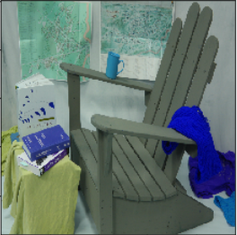
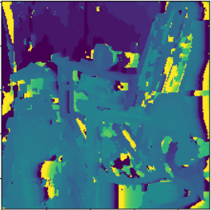
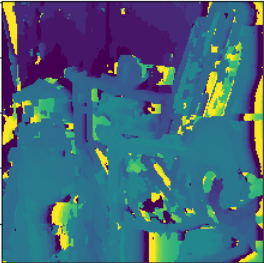
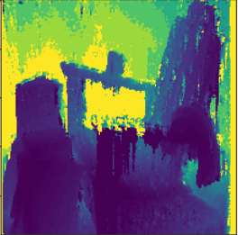

# Stereo
This repo contains python implementations of simple block matching, and the more advanced
semi global matching algorithm, to generate stereograms (depth images) from two corresponding images taken
from calibrated cameras.

### Block Matching
Contains naive implementation which is extremely slow (essentially three loops - for each pixel in image A
template match along the entire epipolar line in image B to find the best match). Vectorized implementation
produces the exact same results but is over 600x faster. There is a version of the vectorized implementation that is
modified to use Cupy rather than Numpy (and to run on a GPU), in my experience this is faster than the vectorized implementation,
and the gap increases the larger the stereo pair used is (800x800 pixels or larger to see a significant difference).

### Semi Global Matching
Implementation of dp algorithm from [this](https://core.ac.uk/download/pdf/11134866.pdf) paper. This is not as optimized
as it could be, it is much faster than the naive block matching but a little slower than the vectorized block matching.
But it produces by far the best results.

### Example output
Here are benchmarks for 480x480 images taken from calibrated cameras (from middlebury dataset 2014) available [here](http://vision.middlebury.edu/stereo/data/scenes2014/)
on my 2.6 GHz Intel Core i7 CPU.

#### Original Image

#### slow block matching: 389.56s

#### vectorized fast block matching: 1.01s

#### semi global matching: 25.78s

